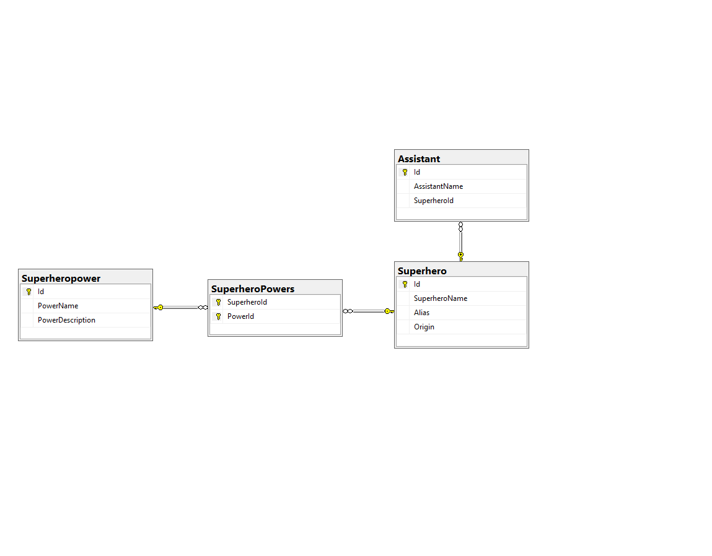

# SQLClient

This console application gives several methods for interacting with the Chinook DB.

## Table of Contents

-   [Install](#install)
-   [Relationship-Diagram](#Relationship-Diagram)
-   [Maintainers](#maintainers)
-   [License](#license)

## Install

```
Download SQL Server Management Studio.
Run script to create Chinook DB.
Setup DB connection in Visual studio to your own DB.
Clone the Repo and run it in your IDE of choice.
```

## Relationship-Diagram

Relationship diagram for DB created in appendix A.



## Maintainers

@InaFPedersen
@Mokleiv

## License

MIT © 2022 Ina Pedersen, Sondre Mokleiv Nygård
