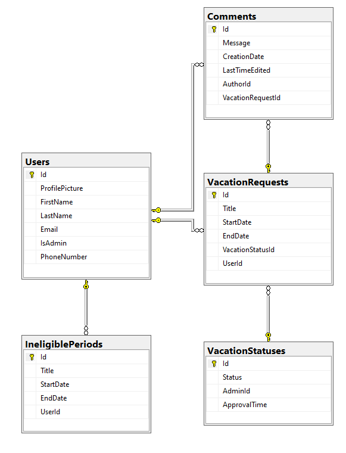

# tidsbanken

[](https://github.com/RichardLitt/standard-readme)

## Name

Vacation Guardian - Backend

## Table of Contents

-   [Description](#description)
-   [Security](#security)
-   [Install](#install)
-   [Usage](#usage)
-   [API](#api)
-   [Database](#database)

## Description

The backend contains two parts a database and a API. The database is a SQL database created with Entity Framework, and the API is created with swagger

## Security

In order to protect the application certain security meassures was implemented. Such as User Authentication and Input Sanitation.
Entity Framework has some builtin input sanitation.
A user can not access the application content (exception of login page) without being authenticated as a user, this is done through the login page and Auth0.

## Install

This project needs the following:

-   Visual Studio or Visual Studio Code
-   A current Auth0 tenant with a client application, API application which is connected to the API Explorer Application as Machine to Machine application.

### App settings

Change the values in `appsettings.json` to the corresponding value from your database and Auth0.


Change the value `DefaultConnection` to a valid connection string, like SQL Server Express server name or Azure SQL connection string.
For Auth0, `Domain` and `Audience` are found within the client and API application settings on the tenant used.
The Auth0 `Connection` is the name of your Auth0 database found in Authentication/Database at Auth0.
`client_id` and `client_secret` are found in the API Explorer Application settings.

Build the project by running this command in the project folder.

```
dotnet restore
```

## Usage

The application can be started in development mode using the following command:

```
dotnet run
```

## API

The API uses Swagger to illustrate the functionality given in the created API. The API contains: Login requests, User requests, Vacation requests, Vacation requests states, Comment requests, and Ineligible period requests.

The API is deployed in Azure.

## Database

The SQL database created with Entity Framework, stores the application's data, where the data is updated as the user sends requests from the frontend part of the application.

The database is deployed in Azure. This figure shows the database diagram.

