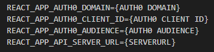

# tidsbanken

[](https://github.com/RichardLitt/standard-readme)

## Name

Vacation Guardian - Frontend

## Table of Contents

-   [Description](#description)
-   [Install](#install)
-   [Usage](#usage)
-   [Login](#login)
-   [Profile](#profile)
-   [Navbar](#navbar)
-   [Dashboard](#dashboard)
-   [CreateVacationRequest](#createVacationRequest)
-   [VacationRequestHistory](#vacationRequestHistory)
-   [DetailedVacationRequest](#detailedVacationRequest)
-   [ListofVacationRequests](#listofVacationRequest)

## Description

The frontend part of the application uses the framework React with the programming language TypeScript. The frontend is the visual output that the user see when they interact with the application. The frontend contains: login page, dashboard, profile, vacation request history, detailed vacation request, list of vacation requests, navbar, and create user. Each frontend part has their own functionalities.

The frontend is deployed in Azure.

## Install

Change the environment variables in `.env` to the corresponding values for your Auth0 tenant and Web API Server URL.
Remember to allow CORS in your browser via an extension if running in localhost (CORS should be disabled at any other time when using the browser).



`Domain` and `client id` can be found in the client application settings of your Auth0 tenant, while `Audience` can be found in the API settings. `Server url` is the url that your Web API is hosted on.

The server url must also be added to the client application settings in the Application URIs.

Install all the dependencies by running this command in the project folder.

```
npm install
```

## Usage

```
npm start
```

## Login

In the login page the user can login to use the application, the login uses Auth0 to authenticate that it is a real user.

## Profile

In the profile page the users can see information about a existing user, the user and administrators can also edit the profile, by changing the names, email, password and profile picture.

## Navbar

Navbar is shown as a header to give the user easy access to the elements in the application. In the navbar there is a dropdown list with the different parts of the application.

## Dashboard

In the dashboard has a calendar and several buttons. From the dashboard the user can see existing vacation requests.

### CreateVacationRequest

From the dashboard the user can open a window to create a vacation request, where the user fills out the necessary information in a form and send it to the server.

## VacationRequestHistory

In Vacation request history the users can see all approved and declined vacation requests from all users.

## DetailedVacationRequest

In detailed vacation request the user can see detailed informations and comments belonging to a specific request.

## ListofVacationRequests

In list of vacation request the user can see all their own request, and the request's status.
