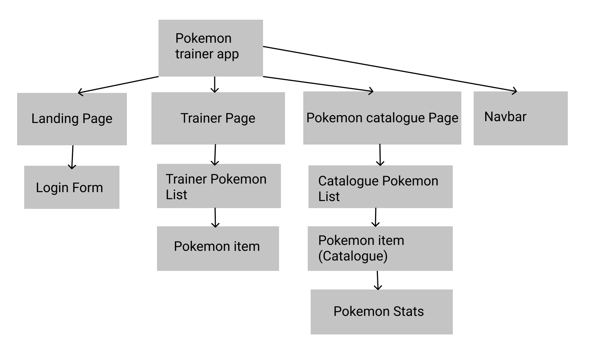

# pokemon-trainer

[](https://github.com/RichardLitt/standard-readme)

Pokémon Trainer web app

Heroku deployment can be found [here](https://aqueous-ravine-79617.herokuapp.com/). Do note that there is a sporadic error where catalogue is duplicated.

## Table of Contents

-   [Install](#install)
-   [Usage](#usage)
-   [Component Tree](#Component Tree)
-   [Maintainers](#maintainers)
-   [Contributing](#contributing)
-   [License](#license)

## Install

```
npm install
```

## Usage

```
ng serve
```

## Component Tree

Here is the component tree that the application is based upon, the pdf can be found [here](./src/assets/Pokemon_trainer_component_tree.pdf).



## Maintainers

@InaFPedersen & @Mikaelb

## Contributing

We would like to thank Dewald for sharing code that we utilised for login and trainer services.

Small note: If editing the README, please conform to the [standard-readme](https://github.com/RichardLitt/standard-readme) specification.

## License

MIT © 2022 Ina F. Pedersen
